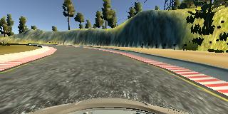
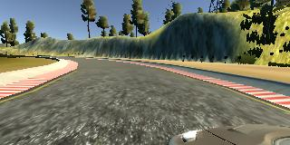
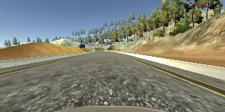

# **Behavioral Cloning** 

## Writeup Template

### You can use this file as a template for your writeup if you want to submit it as a markdown file, but feel free to use some other method and submit a pdf if you prefer.

---

**Behavioral Cloning Project**

The goals / steps of this project are the following:
* Use the simulator to collect data of good driving behavior
* Build, a convolution neural network in Keras that predicts steering angles from images
* Train and validate the model with a training and validation set
* Test that the model successfully drives around track one without leaving the road
* Summarize the results with a written report

## Rubric Points
### Here I will consider the [rubric points](https://review.udacity.com/#!/rubrics/432/view) individually and describe how I addressed each point in my implementation.  

---
### Files Submitted & Code Quality

#### 1. Submission includes all required files and can be used to run the simulator in autonomous mode

My project includes the following files:
* model.py containing the script to create and train the model
* P3_Behavioural_Cloning.ipynb which contains model.py in model.py as well as some visualizations of the image
* drive.py for driving the car in autonomous mode
* drive_model.h5 containing a trained convolution neural network 
* writeup_report.md or writeup_report.pdf summarizing the results

# Model link in google drive
As my model is too large I am ujnable to upload the complete file in github.
As a result please refer below link where I have uploaded the model in google drive

https://drive.google.com/open?id=1PYRaBTCc7MIwWpUW1-XinWfSYhkpiWtr

#### 2. Submission includes functional code
Using the Udacity provided simulator and my drive.py file, the car can be driven autonomously around the track by executing 

'python drive.py drive_model.h5'

#### 3. Submission code is usable and readable

The model.py file contains the code for training and saving the convolution neural network. The file shows the pipeline I used for training and validating the model, and it contains comments to explain how the code works.

### Model Architecture and Training Strategy

#### 1. An appropriate model architecture has been employed

The model architecture consits of the below layers:-

_________________________________________________________________
Layer (type)                 Output Shape              Param #   

--
=================================================================

lambda_5 (Lambda)            (None, 160, 320, 3)       0         
_________________________________________________________________
cropping2d_4 (Cropping2D)    (None, 90, 320, 3)        0         
_________________________________________________________________
conv2d_9 (Conv2D)            (None, 20, 78, 96)        34944     
_________________________________________________________________
activation_12 (Activation)   (None, 20, 78, 96)        0         
_________________________________________________________________
max_pooling2d_6 (MaxPooling2 (None, 10, 39, 96)        0         
_________________________________________________________________
conv2d_10 (Conv2D)           (None, 6, 35, 256)        614656    
_________________________________________________________________
activation_13 (Activation)   (None, 6, 35, 256)        0         
_________________________________________________________________
max_pooling2d_7 (MaxPooling2 (None, 3, 17, 256)        0         
_________________________________________________________________
conv2d_11 (Conv2D)           (None, 1, 15, 384)        885120    
_________________________________________________________________
activation_14 (Activation)   (None, 1, 15, 384)        0         
_________________________________________________________________
flatten_3 (Flatten)          (None, 5760)              0         
_________________________________________________________________
dense_7 (Dense)              (None, 4096)              23597056  
_________________________________________________________________
activation_15 (Activation)   (None, 4096)              0         
_________________________________________________________________
dropout_5 (Dropout)          (None, 4096)              0         
_________________________________________________________________
dense_8 (Dense)              (None, 64)                262208    
_________________________________________________________________
activation_16 (Activation)   (None, 64)                0         
_________________________________________________________________
dropout_6 (Dropout)          (None, 64)                0         
_________________________________________________________________
dense_9 (Dense)              (None, 1)                 65

--
=================================================================
Total params: 25,394,049
Trainable params: 25,394,049
Non-trainable params: 0

#### 3. Model parameter tuning

I have not had the need to tune any of the hyperparameteress.
However I did play around with the architecture.
The architecture implemented is Alexnet from the below link:-
https://engmrk.com/alexnet-implementation-using-keras/

I had to adapt it to fit the simulators images.
The simulator was not providing any changes in the angles hence i decided to try out with a simpler architecture.
The removed layers are commented in the codes.
After removing there layers I started getting a response in the change in steering angles.

#### 4. Appropriate training data

For the training data I recorded 1 lap.
It was adivsed to drive the car in th opposite direction but I did not do so as I 
was able to train the car without it

Here are some of the images generated by the simulator

 Camera Centre

 Camera Left

 Camera Right

### Model Architecture and Training Strategy

#### 1. Solution Design Approach

I have followed the steps as explained in the video.
Initally I was not getting any progress as with the car driving of course at the very first turn.
This was because the steering was stuck.

I finally got the  desired result when I lightned my model architecture 
and did image cropping.

Even then it was driving off track at the dirt.

To solve this issue I then included the flipped images also along with images from right,left cameras
ALong with steering correction.

#### 2. Final Model Architecture

The architecture is given above.

#### 3. Creation of the Training Set & Training Process

I recorded a lap around the circuit.
This was enough as I then able to apply below image processing steps to get the car to take a lap around the circuit:-

  1) Image normalization
  2) Image Cropping
  3) Data Augmentation by including right& Left camera images with steerong correction.
  
  
  
Here is an image of the run from which the video was made 

 Run Image